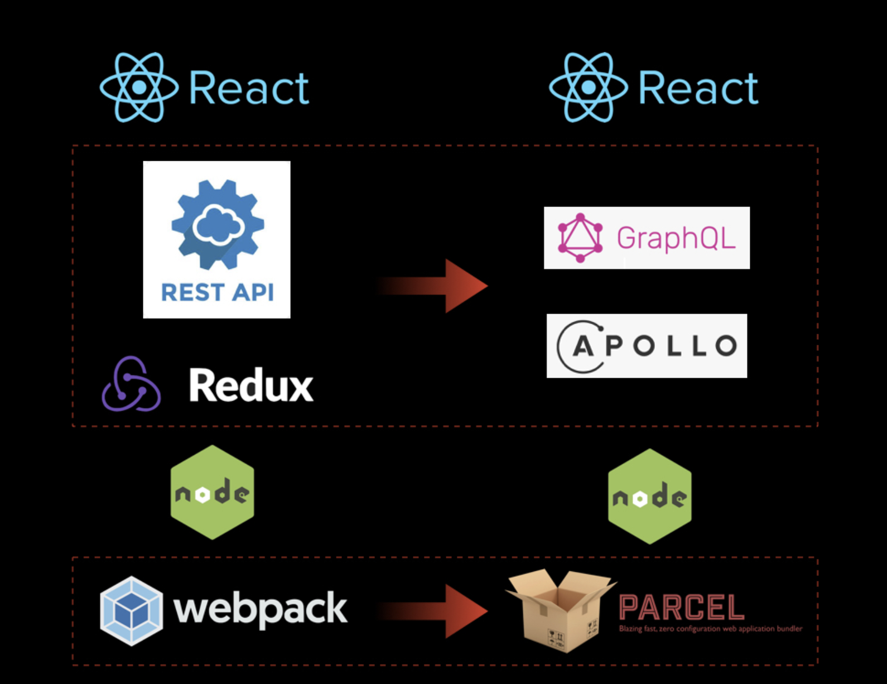

# MovieQL-Client : GraphQL + Apollo + React로 무비앱 만들어보기.

## 1. GraphQL + Apollo 로 REST API + Redux (+ Fetch) 를 대체한다.

> 그림출처 : https://d2.naver.com/helloworld/2838729

REST API 로 주고받던 데이터를
GraphQL로 대체 (+ resolvers JS)
Redux 로 컴포넌트 State 관리를 해오고 서버 통신을 해왔다면, react-apollo로 대체하여 더 쉽게 만들어 보았다.

> Any application that can be written in JavaScript, will eventually be written in JavaScript.

> Stack Overflow : Jeff Atwood

---

# react-router

yarn add react-router-dom --save

# installing the preset package (apollo-boost) and react integration

yarn add apollo-boost react-apollo graphql-tag graphql --save
